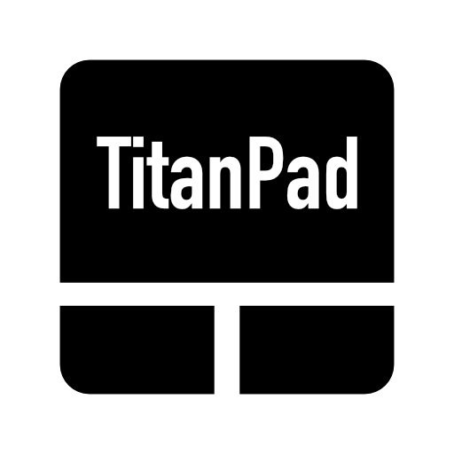
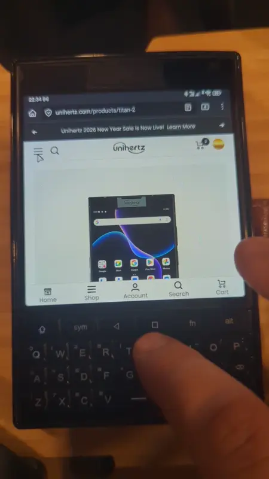
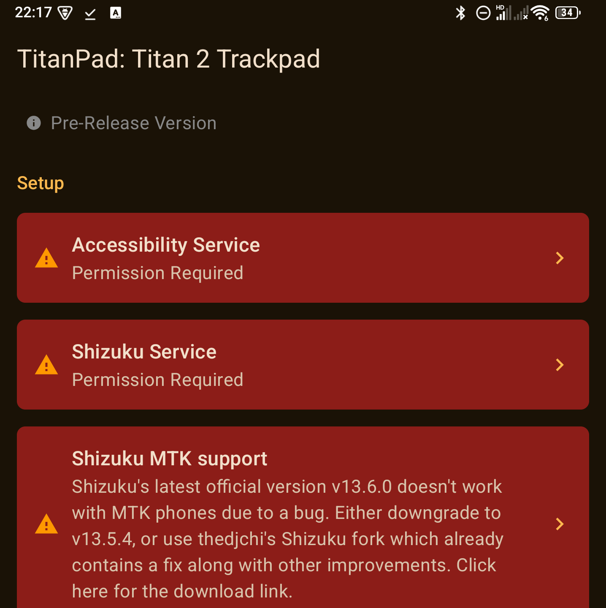
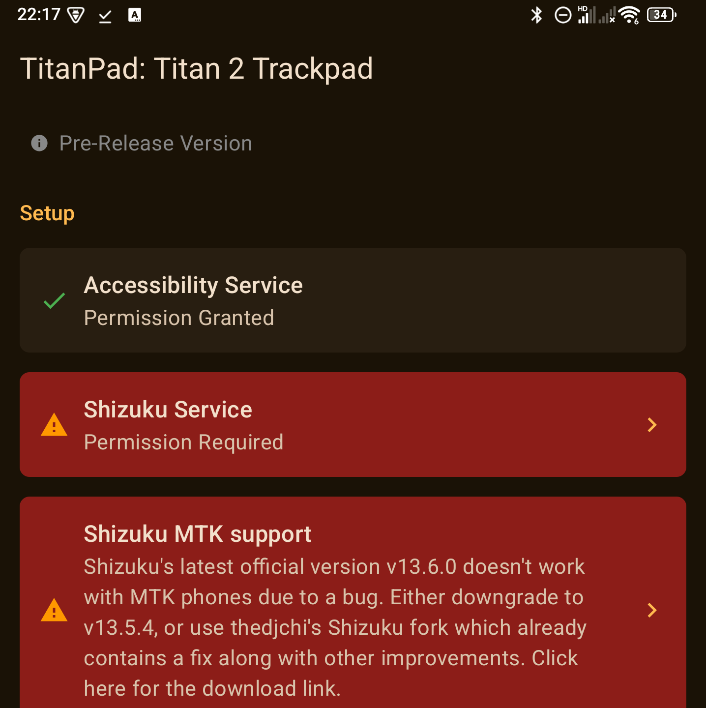
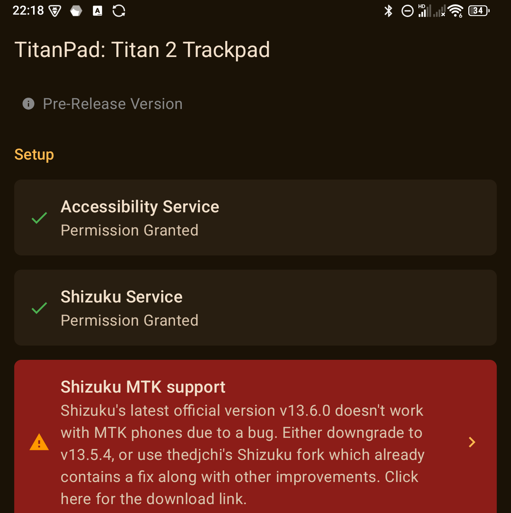
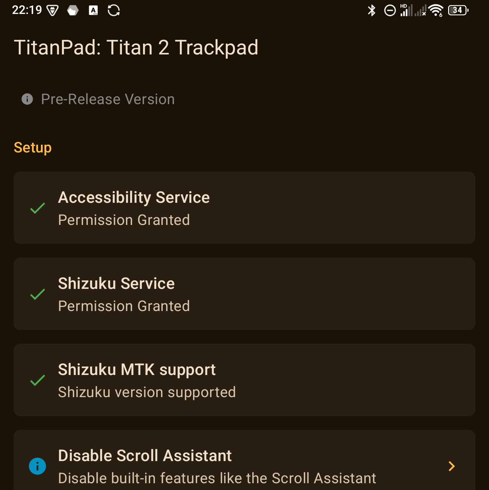
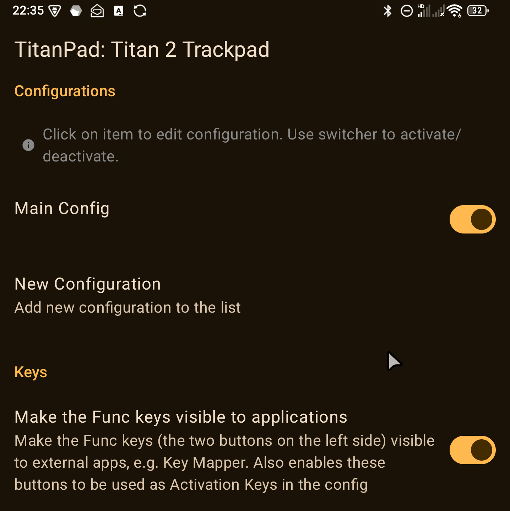
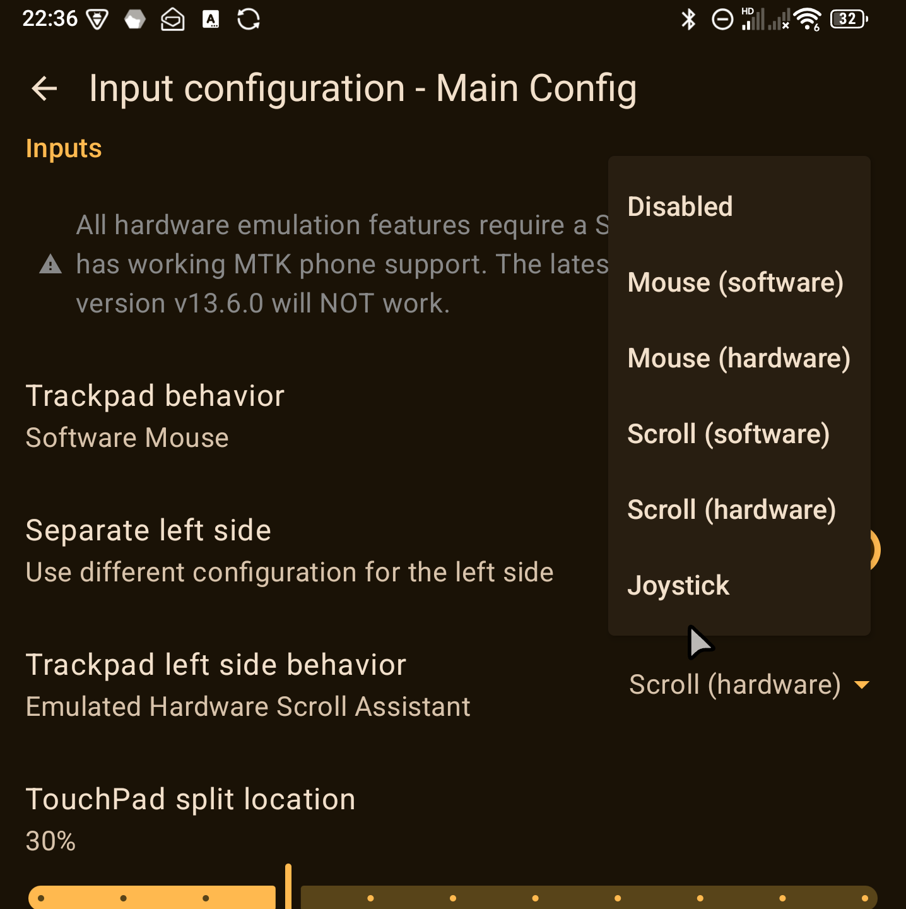
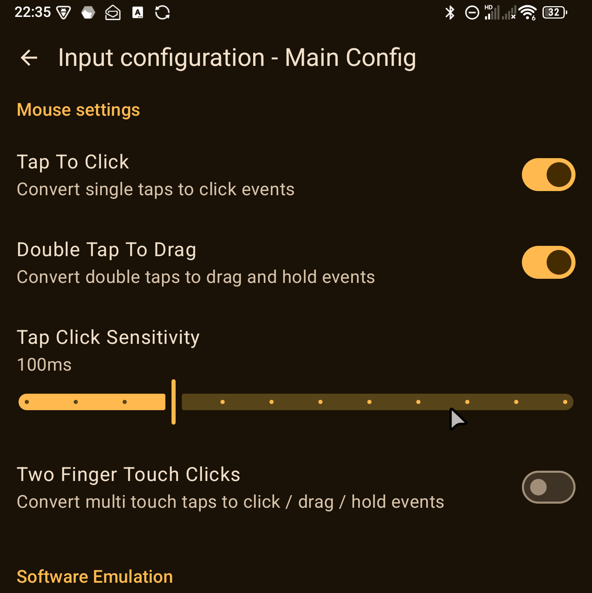
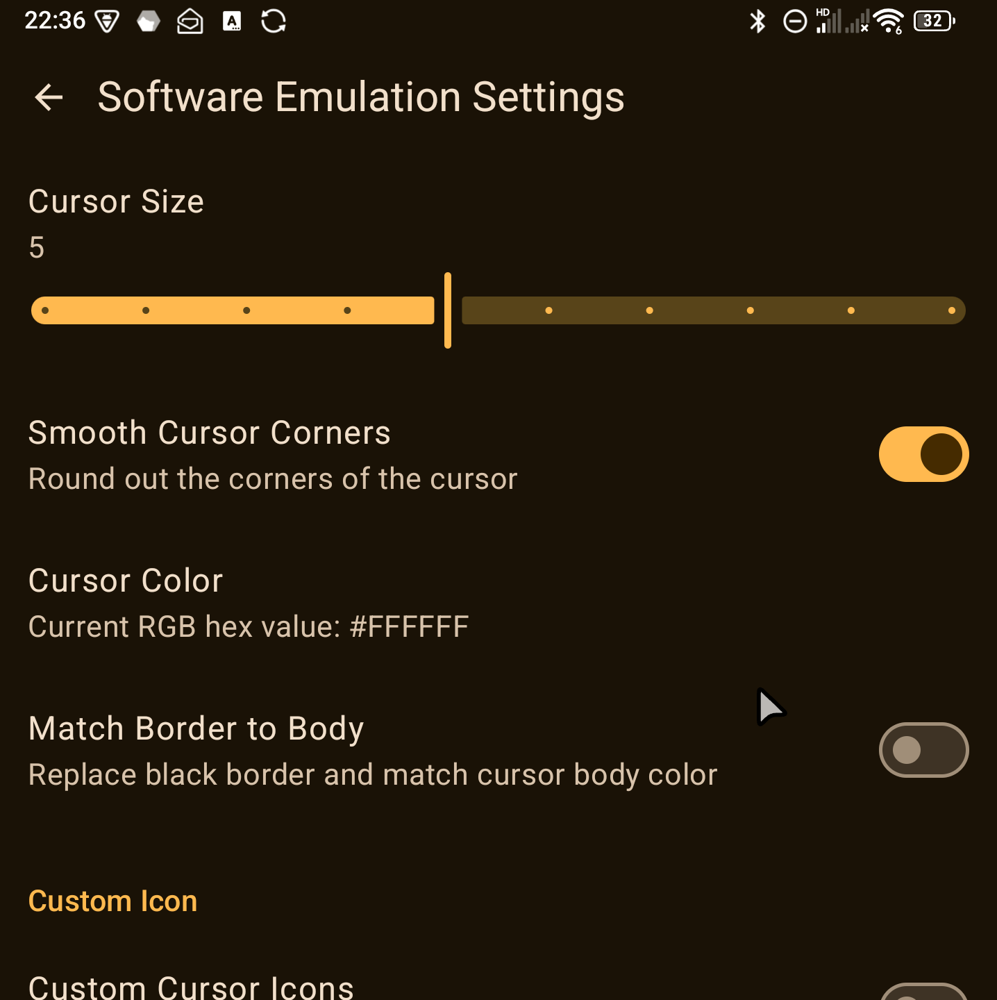

<!--suppress CheckImageSize, CheckImageSize -->eckImageSize -->eckImageSize -->
<div align="center">

</div>

---

# TitanPad: Trackpad mouse for Titan 2

   

<div align="center">

</div>

TitanPad is an Accessibility service for Unihertz Titan 2 allowing you to use the keyboard's capacitive sensor as a trackpad moving a virtual mouse around the screen

## Table of Contents
- [Installation](#installation)
- [Acknowledgment](#acknowledgments)
- [Overview](#overview)
- [Troubleshooting](#troubleshooting)
- [FAQs](#faqs)
- [License](#license)

## Installation
The latest version can be found under [releases](https://github.com/sztupy/TrackPad/releases). You can use GitHub's `Watch > Custom > Releases` option to be notified of new releases.

### Option 1
Install using the standard package installer. Allow the accessibility service using the banner in the application.

### Option 2
Install using adb:
```
>> adb install path/to/apk
>> adb shell settings put secure enabled_accessibility_services scot.raven.titanpad/scot.raven.titanpad.accessibility.AppAccessibilityService
```

### Shizuku
The application also requires you to [install Shizuku](https://github.com/thedjchi/Shizuku/releases) for most features to work.

Note that unless your device is rooted, you will need to restart the Shizuku service upon reboot.

## Acknowledgments
- [austinauyeung](https://github.com/austinauyeung) whose [C9 app](https://github.com/austinauyeung/C9) is used as the fork / core for this project. While it has been stripped from a lot of features C9's Cursor Mode implementation is heavily used as the virtual mouse implementation that doesn't require Shizuku
- [palsoftware](https://github.com/palsoftware/) whose [Pastiera keyboard](https://github.com/palsoftware/pastiera) is one of the best keyboard app for Titan 2. This project also uses the shizuku workaround implemented in it to access the keypad events.
- [PeterGSI](https://gitea.angry.im/PeterGSI) whose [Titan 2 TouchPad Daemon](https://gitea.angry.im/PeterGSI/titan2-touchpadd) implementation contains lots of useful bits for proper mouse integration
- [WuDi-ZhanShen](https://github.com/WuDi-ZhanShen) whose [Pure Java UHid implementation](https://github.com/WuDi-ZhanShen/AndroidUHidPureJava) was used to implement the uhid based mouse support 
- The Unihertz Titan 2 community in general!

## Overview

The app uses some clever tricks to read the keyboard's capacitive sensor and translate it to virtual mouse events, like a Trackpad. It also has some basic multi-touch functionality based on the fact that the sensor while doesn't support multiple fingers, it does support obtaining the approximate size of your touch, so if you use two fingers close to each other it will return a larger touch point. This information can then be used to differentiate between single finger touches and double finger touches.

The application uses C9 as it's base, including most of the setup, meaning general installation steps are:

* Install application
* Install Shizuku [from this repository](https://github.com/thedjchi/Shizuku/releases). Make sure to use this Shizuku fork as the official version does not support MTK phones (like the Titan 2) properly.
* Open application
* Grant both Accessibility permission and Shizuku permission
* Assign activation key. Preferred way is to assign "TAB" for the "Func 2" button under "Android Settings -> Shortcuts", and then assign the "TAB" button as the activation key in the settings.
* Once the activation key is assigned press it and you should be able to access the mouse functionality

Once the mouse is activated it supports the following gestures:

* Single finger move - moving the mouse around
* Single finger tap - single click
* Multi finger move - scroll

Multi finger features are currently calibrated to my fingers which are fairly big.

## Troubleshooting

### Verifying Shizuku authorization
A green banner on the main page indicates that Shizuku authorization has been granted to TitanPad. TitanPad also requires Shizuku with support for MTK phones. Only the fourth screenshot below will result in a fully working application.

<div align="center">




</div>

**WARNING!** Also note that due to a bug in Shizuku v13.6.0 (the latest official release as of February 2026) it does not work fully on MTK phones. You either have to downgrade to v13.5.4, or use [thedjchi's Shizuku fork](https://github.com/thedjchi/Shizuku/releases), which also contain other fixes and improvements. 

## Screenshots

<div align="center">




</div>

## FAQs
### Where can I make feature suggestions or report bugs?
You can use the [issues](https://github.com/sztupy/TitanPad/issues) tab for both.

### How else can I contribute?
Please feel free to submit a pull request, create a video walkthrough, or provide anything else you think would be helpful!

### What is Shizuku?
Shizuku allows applications in general to perform actions that require elevated privileges. In TitanPad, it is required to read the trackpad events on the Keyboard on firmware versions where this is not supported natively, as well as to create and manage virtual mouse devices for more native mouse pointer support.

## License
[Apache License Version 2.0](./LICENSE)
